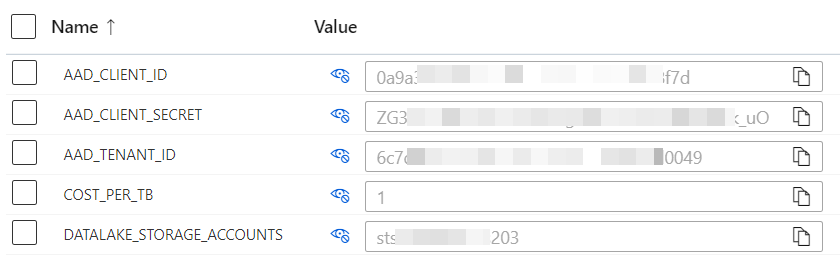

# SAS for EDU

SAS is a storage as a Service platform designed to automate storage allocation in EDU institutions. Its main goal is to provide agility to stakeholders on having access to object storage infrastructure in Microsoft Azure.

Some of the capabilities currently provided by the system are:

* Dynamic creation of top level folder and file systems in Azure Data Lake Storage (ADLS).
* Dynamic addition of object owner as "Execute" in File System's ACL.
* Automatic creation of initial folder under the File System.
* Dynamic addition of folder's onwer under initial folder.
* Exposure of "how to use" the storage infrastructure through Web UI.

# Deploy SAS for EDU
In order to deploy this solution to your environment, you'll need to setup some variables in the build process and create a static web app in Azure. To accomplish this, do the following:

* [Fork the code](#fork-the-code)
* [Create a Static Web App](#create-a-static-web-app)
* [Create an application](#create-an-application)
* [Add secrets](#add-secrets)

## Fork the code
Fork the code into your github repository. You can name the repo whatever you like.

## Create a Static Web App
Create a Static Web App in the Azure Portal. Name it anything you like. Choose whichever plan you like at this time, though you'll probably need the Standard plan when you wish to apply your own domain name. 

> ***Important***, when choosing the GitHub repo, choose your repo instead of the source one.

TODO: Provide Build details guidance

Copy the Static Web App URL for use later.

Copy the deployment token (Click on Manage deployment token) for use later.

Add the App Settings under the Static Web App using Settings -> Configuration. Add a new application setting called DATALAKE_STORAGE_ACCOUNTS. List the name of the storage accounts to use, just the name of the storage account is adequate. Separate the accounts by comma or semicolon.

TODO: Add storage cost per TB

## Create an application
In the Azure portal, go to the Azure Active Directory. Add a new App Registration.
* Provide an Application Name
* Choose the single tenant
* Redirect URI
    * Choose the Single-page application
    * Provide the Static Web App URL

Copy the Directory (tenant) ID for use later.
Copy the Application (client) ID for use later.

## Prepare the storage accounts
In order to allow this application to modify the storage accounts, it will require Storage Blob Data Owner permission for each of the storage accounts.

Considering our App was registered as "sas" under Azure Active Directory, the access control addition would look like the image below.

Enable CORS on the storage accounts pointing to the Static Web App url.

## Create a Static Web App
Create a Static Web App in the Azure Portal. Name it anything you like. Choose whichever plan you like at this time, though you'll probably need the Standard plan when you wish to apply your own domain name. ***Important***, when choosing the GitHub repo, choose your repo instead of the source one.

Copy the Static Web App URL for use later.
Copy the deployment token (Click on Manage deployment token) for use later.

Add the App Settings under the Static Web App using Settings -> Configuration. Add a new application setting called DATALAKE_STORAGE_ACCOUNTS. List the name of the storage accounts to use, just the name of the storage account is adequate. Separate the accounts by comma or semicolon.

## Add secrets
The GitHub workflow has a few required secrets that need to be created to enable it properly. Create the following repository secrets by going to Settings -> Secrets.

Secret|Value|Notes
---|---|---
APP_REGISTRATION_CLIENT_ID|00000000-0000-0000-0000-000000000000|ID of the App Registration in AAD, refered to as the Application (client) ID in the Azure Portal
SAS_DEPLOYMENT_TOKEN||The deployment token of your Static Web App
TENANT_ID|00000000-0000-0000-0000-000000000000|ID of the Azure Active Directory Tenant, refered to as the Tenant ID in the Azure Portal
WEB_URL|https://happy-desert-01a9eac0f.azurestaticapps.net|Url to the website
CLIENT_SECRET|Random code format|Secret used to authenticate access with app registration.

## Storage Account Permissions

TODO: Add instructions for allowing app registration Storage Blob Owner RBAC role on storage accounts

## Build
Now that all of the pieces are present, go to Actions in GitHub and run the Azure SWA Deploy workflow (It should automatically run when code is committed as well). 

TODO: Can't manually trigger due to "if" statements in workflow file?

