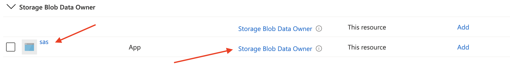

# SAS for EDU


SAS is a Storage-as-a-Service platform designed to automate storage allocation in EDU institutions. Its main goal is to provide agility to stakeholders on having access to object storage infrastructure in Microsoft Azure.

Some of the capabilities currently provided by the system are:

* Dynamic creation of top level folder and file systems in Azure Data Lake Storage (ADLS) Gen 2.
* Dynamic addition of object owner as "Execute" in File System's ACL.
* Automatic creation of initial folder under the File System.
* Dynamic addition of folder's owner under initial folder.
* Exposure of "how to use" the storage infrastructure through Web UI.

## Deploy SAS for EDU

In order to deploy this solution to your environment, you'll need to setup some variables in the build process and create a static web app in Azure. To accomplish this, do the following:

* [Fork the code](#fork-the-code)
* [Create an application registration](#create-an-application-registration)
* [Prepare the storage accounts](#prepare-the-storage-accounts)
* [Create a Static Web App](#create-a-static-web-app)
* [Add secret](#add-secret)

### Fork the code

Fork the code into your github repository. You can name the repo whatever you like.

### Create an Application Registration

Follow these steps to create a new Application Registration:

1. In the Azure Portal, go to Azure Active Directory.
2. Add a new App registration.
3. Provide an application name of your choice.
4. Choose the single tenant option.
5. You can leave the Redirect URL blank.
6. Create the app registration.
7. Create a new secret for the app registration.

Copy the Directory (tenant) ID for use later.
Copy the Application (client) ID for use later.
Copy the Application secret for use later.

### Prepare the storage accounts

In order to allow this application to modify the storage accounts, it will require Storage Blob Data Owner permission for each of the storage accounts.

If you named your application above *sas*, the RBAC entry would look like this:



TODO: Probably not needed anymore
Enable CORS on the storage accounts pointing to the Static Web App url.


### Create a Static Web App

Create a Static Web App in the Azure Portal. Name it anything you like. Choose the Standard plan, which is required to enable custom authentication.

> ***Important***
> When choosing the GitHub repo, choose your repo instead of the source one.

Choose the following Build Details:

* Build Presets: React
* App location: `/src/sas.front`
* Api location: `/src/sas.api`
* Output location: leave to default (`build`)

Copy the Static Web App URL for use later.

Copy the deployment token (Click on Manage deployment token) for use later.

Add the following Application Settings under the Static Web App using the Configuration pane.

| Name | Value |
| --- | --- |
| AZURE_CLIENT_ID | The application ID from the app registration. |
| AZURE_CLIENT_SECRET | The application secret from the app registration. |
| AZURE_TENANT_ID | The tenant ID of your Azure AD. |
| COST_PER_TB | Your monthly cost per terabyte of storage. |
| DATALAKE_STORAGE_ACCOUNTS | A comma-separated list of one or more ADLS Gen2 storage account names that have been prepared following the instructions above. |


### Add secret

The GitHub workflow has a required secrets that needs to be created to enable it properly. Create the following repository secrets by going to Settings -> Secrets.

Secret|Value|Notes
---|---|---
SAS_DEPLOYMENT_TOKEN||The deployment token of your Static Web App.

You can delete the default secret containing your app's deployment token. It will have a name like `AZURE_STATIC_WEB_APPS_API_TOKEN_<unique>` where `<unique>` is the unique part of your web app's URL.

### Clean up the repo

After connecting your fork to the Static Web App, a new workflow YAML file has been created. You can safely delete that file. If you don't, you'll see two GitHub Actions run for every commit to the repo.

### Build

Now that all of the pieces are present, go to Actions in GitHub and run the Azure SWA Deploy workflow (It should automatically run when code is committed as well).

TODO: Can't manually trigger due to "if" statements in workflow file?

[](../../actions/workflows/azure-swa-deploy.yml)

### Application Insights

Optional, but recommended.

## Enable Custom Authentication

Modify staticwebapp.config.json to include:

```json
{
  "auth": {
    "identityProviders": {
      "azureActiveDirectory": {
        "registration": {
          "openIdIssuer": "https://login.microsoftonline.com/<TENANT_ID>/v2.0",
          "clientIdSettingName": "AAD_CLIENT_ID",
          "clientSecretSettingName": "AAD_CLIENT_SECRET"
        }
      }
    }
  }
}
```

Replace <TENANT_ID> with your Azure AD tenant ID.

Modify the Application Registration to include callbacks for login and logout.

Login: https://<YOUR_SITE>/.auth/login/aad/callback

Logout: https://<YOUR_SITE>/.auth/logout/aad/callback

Replace <YOUR_SITE> with the URL to your Static Web App.
